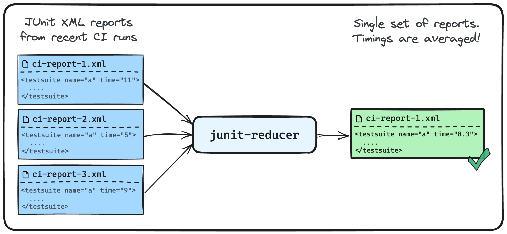

# junit-reducer-action

<!-- markdownlint-disable MD013 MD033 -->

[](https://github.com/super-linter/super-linter)

[](https://github.com/willgeorgetaylor/junit-reducer-action/actions/workflows/check-dist.yml)
[](https://github.com/willgeorgetaylor/junit-reducer-action/actions/workflows/codeql-analysis.yml)
[](./badges/coverage.svg)

JUnit Reducer is a command-line tool that aggregates the [JUnit test XML reports](https://www.ibm.com/docs/en/developer-for-zos/14.1?topic=formats-junit-xml-format) from your CI runs and creates a single, averaged report set. This lets you download a smaller set of reports, during CI runs, to inform your test splitting.

<picture>
  <source media="(prefers-color-scheme: dark)" srcset="./diagram-dark.png">
  
</picture>

## Quickstart

Typically, you'll be using `junit-reducer` within a scheduled cron task to reduce a trailing window of JUnit XML reports. From a speed and cost perspective, it's generally a good idea to retrieve and store both the inputs (JUnit XML reports) and outputs (averaged XML reports) in a cloud storage service like AWS S3 or Google Cloud Storage as opposed to the caching APIs available from the CI providers themselves.

## Inputs

All inputs are optional. However, these are the most important:

| Name | Description | Type | Default |
| :---  | :--- | :--- | :--- |
| `include` | Glob pattern to find input JUnit XML reports | `string` | `./**/*.xml` |
| `output-path` | Output path for synthetic JUnit XML reports | `string` | `./output/` |
| `exclude` | Glob pattern to exclude from input JUnit XML reports | `string` |  |
| `version` | Version of [junit-reducer](https://github.com/willgeorgetaylor/junit-reducer/releases) command-line tool to use (e.g., `v1.0.0` or `latest`) | `string` | `latest` |

### Additional inputs

| Name | Description | Type | Default |
| :---  | :--- | :--- | :--- |
| `op-suites-time` | Operation for test suites time. Options: `max`, `mean`, `median`, `min`, `mode` or `sum` | `string` | `mean` |
| `op-cases-time` | Operation for test cases time. Options: `max`, `mean`, `median`, `min`, `mode` or `sum` | `string` | `mean` |
| `op-suites-assertions` | Operation for test suites assertions. Options: `max`, `mean`, `median`, `min`, `mode` or `sum` | `string` | `mean` |
| `op-suites-errors` | Operation for test suites errors. Options: `max`, `mean`, `median`, `min`, `mode` or `sum` | `string` | `mean` |
| `op-suites-failures` | Operation for test suites failures. Options: `max`, `mean`, `median`, `min`, `mode` or `sum` | `string` | `mean` |
| `op-suites-skipped` | Operation for test suites skipped. Options: `max`, `mean`, `median`, `min`, `mode` or `sum` | `string` | `mean` |
| `op-suites-tests` | Operation for test suites tests. Options: `max`, `mean`, `median`, `min`, `mode` or `sum` | `string` | `mean` |
| `reduce-suites-by` | Operation for test suites tests. Options: `filepath`, `name` or `name+filepath` | `string` | `name+filepath` |
| `reduce-cases-by` | Reduce test cases by name, classname, or file. Options: `classname`, `file` or `name` | `string` | `name` |
| `rounding-mode` | Rounding mode for counts that should be integers. Options: `ceil`, `floor` or `round` | `string` | `round` |

## Example Workflow

```yaml
name: junit-test-report-averaging
run-name: Create Average JUnit Test Reports
on:
  schedule:
      # Run every morning at 8AM
      - cron:  '0 8 * * *'
jobs:
  reduce-reports:
    runs-on: ubuntu-latest
    steps:
      # Configure with the Cloud storage provider of your choice.
      - name: Setup AWS CLI
        uses: aws-actions/configure-aws-credentials@v4
        with:
          aws-access-key-id: ${{ secrets.YOUR_AWS_ACCESS_KEY_ID }}
          aws-secret-access-key: ${{ secrets.YOUR_AWS_SECRET_ACCESS_KEY }}
          aws-region: eu-west-2

      # Download all test reports from all CI runs.
      # It is recommended to set up a lifecycle rule, to remove objects older
      # than a certain age from this bucket/path. This will help to keep the test reports
      # current and keep this job from taking too long.
      - name: Download test timings
        run: |
          aws s3 cp s3://your-junit-report-bucket/ci-runs-reports/ reports/ \
            --recursive

      - name: Reduce reports
        uses: willgeorgetaylor/junit-reducer-action
        with:
          include: ./reports/**/*
          output-path: ./average-reports/

      # Upload the reduced set of test reports to a dedicated bucket/path.
      # In your actual CI process, the CI runners will copy the contents of
      # this path locally, to be ingested by the test splitter.
      - name: Upload single set of averaged reports
        run: |
          aws s3 sync ./average-reports s3://your-junit-report-bucket/average-reports/ \
            --size-only \
            --cache-control max-age=86400
```

## Why?

As your test suite grows, you may want to start splitting tests between multiple test runners, to be **executed concurrently.** While it's relatively simple to divide up your test suites by files, using lines of code (LOC) as a proxy for test duration, the LOC metric is still just an approximation and will result in uneven individual (and therefore overall slower) test run times as your codebase and test suites change.

### Faster CI

The preferable approach for splitting test suites accurately is to use **recently reported test times,** and the most popular format for exchanging test data (including timings) between tools is the [JUnit XML reports format](https://www.ibm.com/docs/en/developer-for-zos/14.1?topic=formats-junit-xml-format). While JUnit itself is a Java project, the schema that defines JUnit reports is equally applicable to any language and reports can be generated by most testing frameworks for JavaScript, Ruby, Python etc.

In busier projects, CI will be uploading reports frequently, so even if you take a small time window (for example, the last 24 hours), you could end up with 20MB+ of test reports. These reports need to be **downloaded to every runner in your concurrency set,** only to then perform the same splitting operation to **yield the exact same time estimates.** This means unnecessary and expensive work is being performed by each concurrent runner, potentially delaying the total test time by minutes and increasing CI costs.

### Coverage integrity

In very busy projects, there is also a more **problematic race condition possible**, with larger downloads and test runners starting at different times. As CI runs from other commits upload their reports to the same remote source that you're downloading them from, if any of your concurrent runners download reports with different values, the input data is misaligned and the splitting operation is corrupted. However, because the download and splitting operation is being performed in a distributed manner (across all of the runners concurrently) this misalignment is not discoverable and it is likely that some tests in your run will be **skipped without you knowing it happened.**

This risk can be mitigated by computing the averaged reports in one place, and updating that set as part of a scheduled job. This is exactly the approach outlined in the [quickstart](https://github.com/willgeorgetaylor/junit-reducer?tab=readme-ov-file#quickstart) section.

## Dependencies

This action invokes [willgeorgetaylor/junit-reducer](https://github.com/willgeorgetaylor/junit-reducer) to reduce the test reports.

If you prefer to use the command-line tool directly, there are instructions for that on the [repository readme](https://github.com/willgeorgetaylor/junit-reducer?tab=readme-ov-file#github-actions).
